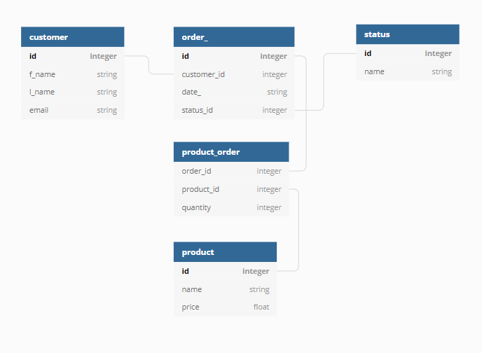

## Asmenys, sąskaitos, bankai
Padaryti programą, kurį leistų įvesti asmenis, bankus, asmenims priskirti sąskaitas bankuose.
* Asmuo turi vardą, pavardę, asmens kodą, tel. numerį.
* Bankas turi pavadinimą, adresą, banko kodą, SWIFT kodą
* Sąskaita turi numerį, balansą, priskirtą asmenį ir banką
* Asmuo gali turėti daug sąskaitų tame pačiame arba skirtinguose bankuose

1. Padaryti duomenų bazės schemą.
2. Sukurti programą su UI konsolėje, kuri leistų įvesti asmenis, bankus, sąskaitas. Leistų vartotojui peržiūrėti savo sąskaitas ir jų informaciją, pridėti arba nuimti iš jų pinigų. Taip pat leistų bendrai peržiūrėti visus bankus, vartotojus, sąskaitas ir jų informaciją.


## Komercija

1. Su SQLAlchemy sukurkite modelį pagal šią diagramą:
   


kurdami many2many ryšį nenaudokite association table, vietoje jos sukurkite tarpinę lentelę kaip objektą, pagal tokį pavyzdį:

```
class OrderProduct(Base):
    __tablename__='order_product'
    id = Column(Integer, primary_key=True)
    order_id = Column("order_id", Integer, ForeignKey('order_.id'))
    product_id = Column("project_id", Integer, ForeignKey('product.id'))
    quantity = Column("quantity", Integer)
    order = relationship("Order")
    product = relationship("Product")
```

1. Parašykite programą, kuri naudojantis jūsų sukurtu modeliu leistų:
* Pridėti pirkėją
* Pridėti produktą
* Pridėti statusą
* Pridėti užsakymą
* Ištraukti užsakymą pagal id
* Pakeisti užsakymo statusą pagal užsakymo id
* Pridėti į užsakymą produktus su kiekiais
